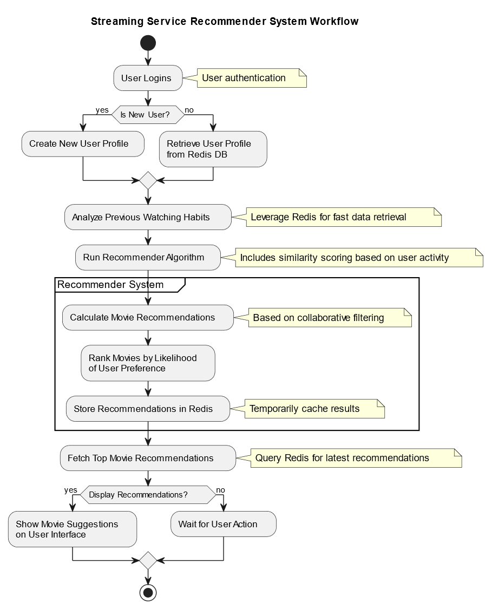

# Overview 

The Streaming Service Recommendation System utilizes Redis, a NoSQL database, for efficient backend processing and data management. The system's core includes a meticulously structured Redis database to manage diverse data types such as user profiles, movie metadata, ratings, and user interactions. Redis's high-speed data retrieval and updates are crucial for real-time recommendation delivery. The system architecture comprises Python-based modules for data loading, encryption, and user management, ensuring data security and integrity. The recommendation algorithm leverages user ratings and preferences to compute similarity scores, enhancing user engagement with personalized content. Redis supports the system's scalability, handling large datasets and supporting horizontal scaling. This project exemplifies the use of advanced database technologies in delivering personalized content in the streaming industry.

# Features

1. **Efficient Data Management:** Uses `Redis` for storing and retrieving large datasets, including user profiles and movie metadata, ensuring quick access and updates.

2. **Advanced Recommendation Algorithm:** Incorporates `Python scripts` and `Redis` for implementing collaborative filtering, providing accurate and personalized movie suggestions.

3. **Scalable Architecture:** Designed with Python's `Flask framework and Redis`, it efficiently handles real-time data processing and high user traffic.

4. **User and Movie Data Handling:** Employs Flask for user interface and Redis for data storage, focusing on secure data management and encryption.

5. **Performance Optimization:** Utilizes `Python's multiprocessing` capabilities and `Redis' in-memory data structure` store for high performance and low latency.

## System Architecture


## Installation

### Prerequisites
- Python 3.x
- pip (Python package manager)
- Git

### Steps
#### 1. Clone the Repository
```
git clone https://github.com/venkateshtantravahi/StreamingServiceRecommendation.git

cd StreamingServiceRecommendation
```

#### 2. Set Up a Virtual Environment
- Windows:
```
python -m venv venv
venv\Scripts\activate
```
- Linux/Mac:
```
python3 -m venv venv
source venv/bin/activate
```

#### 3. Install Dependencies
```
pip install -r requirements.txt
```

#### 4. Set Environment Variables
- Create a `.env` file in the project root directory.
- Set the necessary environment variables (e.g., `SECRET_KEY`).
- For Redis, set `redis_host` and `redis_port` in the `Config` class in `config.py`.
- Once setting up everything to go a head with application run you have to make sure that your database is running to intialise things up before some requests are done to the database. To do this open up a new terminal and type the following command.

```
$ redis-server
```

#### 5. Pre-loading the data
Incase you wana load the data into the application database before hand to testing purposes you can use the following command and make sure to change the file paths in the `data_loader.py` file for proper functionality.

```
$ python data_loader.py
```


#### 6. Initialize the Flask Application
- Windows:
```
# set FLASK_APP=run.py
# set FLASK_ENV=development
# flask run
```

- Linux/Mac:
```
$ export FLASK_APP=run.py
$ export FLASK_ENV=development
$ flask run
```

- Incase want to expose to allow requests from all different ports 
```
$ # Run the application
$ # --host=0.0.0.0 - expose the app on all network interfaces (default 127.0.0.1)
$ # --port=5000    - specify the app port (default 5000)  
$ flask run --host=0.0.0.0 --port=5000
$ # to enter debug mode 
$ flask --debug run --host=0.0.0.0 --port=5000
$ # Access the app in browser: http://127.0.0.1:5000/
```

# Code Base Structure
```
StreamingServiceRecommendation
├── Readme.md
├── app
│   ├── Insights.ipynb
│   ├── __init__.py
│   ├── helpers
│   │   └── helper_functions.py
│   ├── models.py
│   ├── recommendations.py
│   ├── static
│   ├── templates
│   │   └── index.html
│   └── views.py
├── config.py
├── data_loader.py
├── dump.rdb
├── pyrightconfig.json
├── requirements.txt
└── run.py

```

# Logging
"Logging in our application is set up to assist in monitoring and debugging. It captures detailed information about the application's execution, errors, and important state changes. This helps in identifying issues quickly and understanding the behavior of the application under different scenarios. Logs are stored in 'app.log' and also displayed in the console for error-level messages."

# Contribution
We welcome contributions to our project. If you're interested in contributing, please:
- Fork the repository.
- Create a new branch for your feature.
- Commit your changes with clear, descriptive messages.
- Push to the branch and submit a pull request.
- Ensure your code adheres to the project's style and requirements.
- Include unit tests wherever possible.
